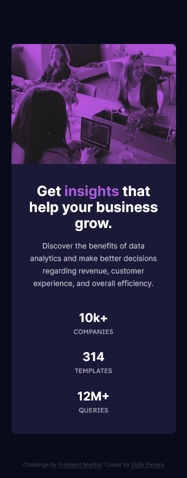

# Frontend Mentor - Stats preview card component solution

This is a solution to the [Stats preview card component challenge on Frontend Mentor](https://www.frontendmentor.io/challenges/stats-preview-card-component-8JqbgoU62). Frontend Mentor challenges help you improve your coding skills by building realistic projects.

-------

## Table of contents

- [Overview](#overview)
  - [The challenge](#the-challenge)
  - [Screenshot Solution](#screenshot-solution)
  - [Links](#links)
- [My process](#my-process)
  - [Built with](#built-with)
  - [What I learned](#what-i-learned)
- [Author](#author)

-------

## Overview

  ### **The challenge**

Users should be able to:

- View the optimal layout depending on their device's screen size

### Screenshot Solution

| Desktop | Mobile |
|---|---|
|||

-------

### Links

- Live project on [GitHub](https://guilepereira.github.io/html-css/stats-preview-card/)

- Solution on [Stats Preview Card by Guile Pereira](https://www.frontendmentor.io/solutions/stats-preview-card-mobile-first-bem-atomic-UAKZ9hU7Oh)

## My process

In this project I tried to improve my coding process based on the perceptions and feedbacks I had in previous projects, so my focus was to refine my accuracy in achieving the proposed design.

### Built with

- Semantic HTML5 markup;
- CSS Variables (Custom properties);
- Flexbox;
- Grid;
- Accessibility;
- Mobile First;
- Methodology BEM (Block Element Modifier);
- Atomic Design.

### What I learned

In this project I was challenged when I needed to think of alternatives to adapt the layout using grid and also when I needed to treat an image using only css. For this last situation, I learned to use filters and also the mix-blend-mode property, which I really liked the results!

## Author

- LinkedIn - [Guile Pereira](https://www.linkedin.com/in/guilevpereira/)
- GitHub - [Guile Pereira](https://github.com/guilepereira)
- Frontend Mentor - [@guilepereira](https://www.frontendmentor.io/profile/guilepereira)
